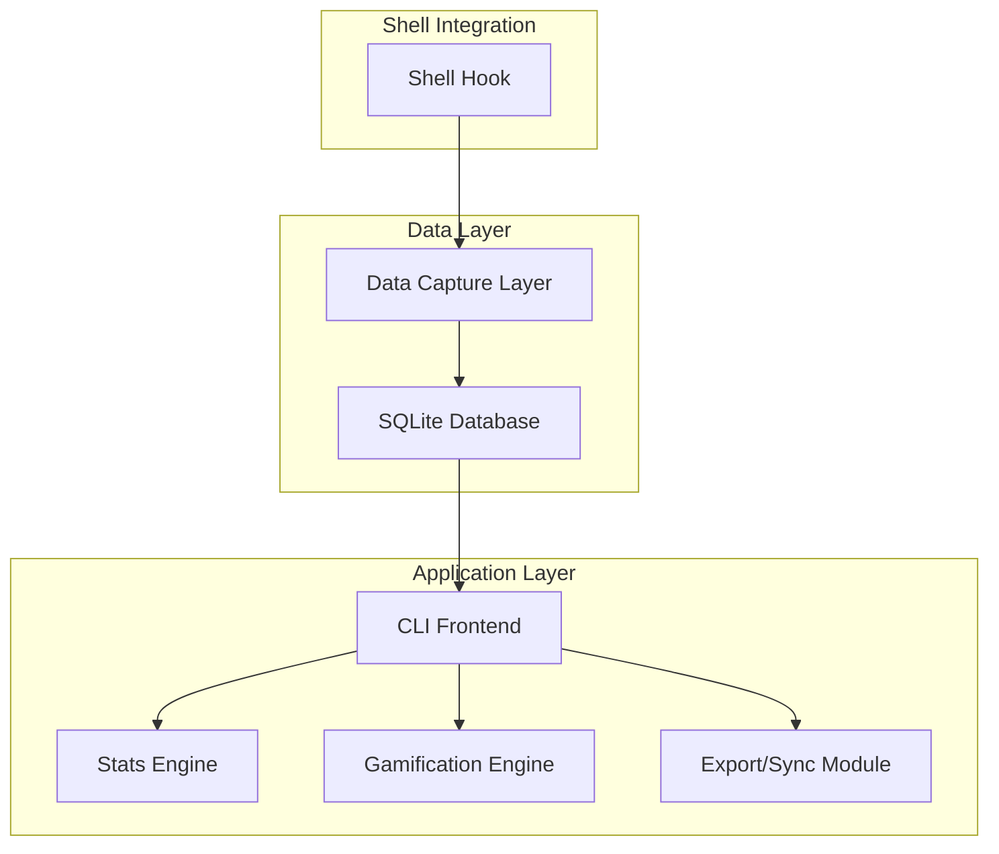

# 🛠️ Termonaut Development Guide

This document provides comprehensive guidance for developers contributing to Termonaut, including architecture overview, development setup, testing strategies, and coding standards.

## 📋 Table of Contents

- [Architecture Overview](#architecture-overview)
- [Technology Stack](#technology-stack)
- [Development Setup](#development-setup)
- [Project Structure](#project-structure)
- [Database Schema](#database-schema)
- [Shell Integration](#shell-integration)
- [CLI Interface Design](#cli-interface-design)
- [Gamification System](#gamification-system)
- [Testing Strategy](#testing-strategy)
- [Coding Standards](#coding-standards)
- [Release Process](#release-process)
- [Troubleshooting](#troubleshooting)

## 🏗️ Architecture Overview

Termonaut follows a modular architecture with three main components:



### Core Components

1. **Shell Integration Layer**
   - Hooks into shell prompt commands (preexec, PROMPT_COMMAND)
   - Captures command metadata (timestamp, command, exit code, cwd)
   - Minimal performance impact with async logging

2. **Data Storage Layer**
   - SQLite database for structured data storage
   - Efficient indexing for fast queries
   - Transaction support for data integrity

3. **CLI Frontend**
   - Command-line interface using Cobra (Go) or Click (Python)
   - Subcommand-based structure following CLI best practices
   - Rich terminal output with configurable themes

4. **Processing Engines**
   - Stats computation and aggregation
   - Gamification logic (XP, levels, achievements)
   - Export and synchronization features

## 🔧 Technology Stack

### Primary Language Options

**Option A: Go (Recommended)**
- **Pros**: Single binary, excellent performance, strong CLI ecosystem
- **Cons**: Steeper learning curve, less rapid prototyping
- **Libraries**:
  - CLI: `cobra` + `viper` for configuration
  - Database: `go-sqlite3` or `modernc.org/sqlite`
  - UI: `bubbletea` for TUI components

**Option B: Python**
- **Pros**: Rapid development, rich ecosystem, easier testing
- **Cons**: Runtime dependency, distribution complexity
- **Libraries**:
  - CLI: `typer` or `click`
  - Database: `sqlite3` (built-in)
  - UI: `rich` for terminal formatting

### Supporting Technologies

- **Database**: SQLite 3.x for local storage
- **Configuration**: TOML format via `viper` (Go) or `tomli` (Python)
- **Testing**: Native testing frameworks + `testify` (Go) or `pytest` (Python)
- **CI/CD**: GitHub Actions for automated testing and releases

## 🚀 Development Setup

### Prerequisites

**For Go Development:**
```bash
# Install Go 1.21+
go version

# Install development tools
go install github.com/golangci/golangci-lint/cmd/golangci-lint@latest
go install github.com/swaggo/swag/cmd/swag@latest
```

**For Python Development:**
```bash
# Install Python 3.9+
python --version

# Install development dependencies
pip install -r requirements-dev.txt
```

### Project Setup

1. **Clone Repository**
```bash
git clone https://github.com/yourusername/termonaut.git
cd termonaut
```

2. **Setup Development Environment**
```bash
# For Go
make dev-setup-go

# For Python
make dev-setup-python

# Or run setup script
./scripts/dev-setup.sh
```

3. **Install Pre-commit Hooks**
```bash
# Install pre-commit
pip install pre-commit
pre-commit install

# Or use the provided script
./scripts/install-hooks.sh
```

4. **Verify Setup**
```bash
make test
make build
./bin/termonaut version
```

### Development Workflow

1. **Create Feature Branch**
```bash
git checkout -b feature/your-feature-name
```

2. **Run Tests During Development**
```bash
# Run all tests
make test

# Run with coverage
make test-coverage

# Run specific test suite
make test-unit
make test-integration
```

3. **Code Quality Checks**
```bash
# Lint code
make lint

# Format code
make format

# Security scan
make security-scan
```

4. **Build and Test Locally**
```bash
# Build binary
make build

# Install locally for testing
make install-local

# Test shell integration
termonaut init --shell zsh
source ~/.zshrc
```

## 📁 Project Structure

```
termonaut/
├── cmd/                    # CLI commands and entry points
│   ├── root.go            # Root command setup
│   ├── stats.go           # Stats subcommand
│   ├── config.go          # Configuration management
│   └── init.go            # Shell integration setup
├── internal/              # Private application code
│   ├── config/            # Configuration management
│   ├── database/          # Database operations
│   ├── gamification/      # XP and achievement logic
│   ├── shell/             # Shell hook integration
│   ├── stats/             # Statistics computation
│   └── export/            # Export and sync functionality
├── pkg/                   # Public library code
│   ├── models/            # Data models
│   └── utils/             # Shared utilities
├── scripts/               # Development and deployment scripts
│   ├── dev-setup.sh       # Development environment setup
│   ├── install.sh         # User installation script
│   └── release.sh         # Release automation
├── tests/                 # Test files
│   ├── unit/              # Unit tests
│   ├── integration/       # Integration tests
│   └── fixtures/          # Test data and fixtures
├── docs/                  # Documentation
├── .github/               # GitHub workflows and templates
│   ├── workflows/         # CI/CD pipelines
│   └── ISSUE_TEMPLATE/    # Issue templates
├── Makefile               # Build and development tasks
├── go.mod                 # Go dependencies (if using Go)
├── requirements.txt       # Python dependencies (if using Python)
└── README.md              # Project overview
```

## 🗄️ Database Schema

### SQLite Tables

```sql
-- Commands table: stores each executed command
CREATE TABLE commands (
    id INTEGER PRIMARY KEY AUTOINCREMENT,
    timestamp DATETIME NOT NULL DEFAULT CURRENT_TIMESTAMP,
    session_id INTEGER NOT NULL,
    command TEXT NOT NULL,
    exit_code INTEGER DEFAULT 0,
    cwd TEXT,
    duration_ms INTEGER,
    FOREIGN KEY (session_id) REFERENCES sessions(id)
);

-- Indexes for performance
CREATE INDEX idx_commands_timestamp ON commands(timestamp);
CREATE INDEX idx_commands_session ON commands(session_id);
CREATE INDEX idx_commands_command ON commands(command);

-- Sessions table: groups commands by terminal session
CREATE TABLE sessions (
    id INTEGER PRIMARY KEY AUTOINCREMENT,
    start_time DATETIME NOT NULL DEFAULT CURRENT_TIMESTAMP,
    end_time DATETIME,
    terminal_pid INTEGER,
    shell_type TEXT,
    total_commands INTEGER DEFAULT 0
);

CREATE INDEX idx_sessions_start ON sessions(start_time);

-- XP tracking: stores gamification progress
CREATE TABLE user_progress (
    id INTEGER PRIMARY KEY CHECK (id = 1), -- Singleton table
    total_xp INTEGER NOT NULL DEFAULT 0,
    current_level INTEGER NOT NULL DEFAULT 1,
    commands_count INTEGER NOT NULL DEFAULT 0,
    unique_commands_count INTEGER NOT NULL DEFAULT 0,
    longest_streak INTEGER NOT NULL DEFAULT 0,
    current_streak INTEGER NOT NULL DEFAULT 0,
    last_activity_date DATE,
    created_at DATETIME NOT NULL DEFAULT CURRENT_TIMESTAMP,
    updated_at DATETIME NOT NULL DEFAULT CURRENT_TIMESTAMP
);

-- Achievements: tracks earned badges
CREATE TABLE achievements (
    id TEXT PRIMARY KEY,              -- achievement identifier
    name TEXT NOT NULL,               -- display name
    description TEXT,                 -- achievement description
    earned_at DATETIME NOT NULL DEFAULT CURRENT_TIMESTAMP,
    xp_bonus INTEGER DEFAULT 0        -- XP awarded for achievement
);

-- Command categories: for command classification
CREATE TABLE command_categories (
    id INTEGER PRIMARY KEY AUTOINCREMENT,
    command_pattern TEXT NOT NULL,    -- regex pattern
    category TEXT NOT NULL,           -- category name (git, file, system, etc.)
    priority INTEGER DEFAULT 0       -- matching priority
);

-- Daily stats cache: for performance optimization
CREATE TABLE daily_stats (
    date DATE PRIMARY KEY,
    commands_count INTEGER NOT NULL DEFAULT 0,
    unique_commands_count INTEGER NOT NULL DEFAULT 0,
    session_count INTEGER NOT NULL DEFAULT 0,
    active_time_minutes INTEGER NOT NULL DEFAULT 0,
    xp_earned INTEGER NOT NULL DEFAULT 0,
    created_at DATETIME NOT NULL DEFAULT CURRENT_TIMESTAMP
);
```

### Database Operations

**Key Patterns:**
- Use transactions for consistency
- Implement connection pooling for performance
- Regular database maintenance (VACUUM, ANALYZE)
- Backup strategies for user data

## 🐚 Shell Integration

### Hook Implementation

**Zsh Integration:**
```bash
# ~/.zshrc addition
termonaut_preexec() {
    termonaut log-command "$1" &
}
add-zsh-hook preexec termonaut_preexec
```

**Bash Integration:**
```bash
# ~/.bashrc addition
termonaut_log_command() {
    if [ -n "$BASH_COMMAND" ]; then
        termonaut log-command "$BASH_COMMAND" &
    fi
}
trap 'termonaut_log_command' DEBUG
```

### Session Management

- Detect new terminal sessions via process PID
- Handle session timeouts (configurable idle time)
- Track session metadata (shell type, start/end times)

### Performance Considerations

- Async logging to avoid blocking shell
- Batch database writes for efficiency
- Minimal hook overhead (< 1ms per command)

## 🎮 CLI Interface Design

### Command Structure

Following CLI best practices with consistent verb-noun patterns:

```bash
termonaut <subcommand> [flags] [arguments]
```

### Subcommands

**Core Commands:**
- `termonaut init` - Setup shell integration
- `termonaut stats [--period]` - Display statistics
- `termonaut sessions` - Show session history
- `termonaut xp` - Show gamification progress

**Configuration:**
- `termonaut config get [key]` - Get configuration values
- `termonaut config set <key> <value>` - Set configuration
- `termonaut config reset` - Reset to defaults

**Data Management:**
- `termonaut export [--format] [--output]` - Export data
- `termonaut import <file>` - Import data
- `termonaut backup` - Create backup

**Gamification:**
- `termonaut badges [list|progress]` - Achievement management
- `termonaut level` - Level information
- `termonaut leaderboard` - Compare with others (future)

### Output Formatting

**Human-Readable (Default):**
- Rich terminal formatting with colors and emojis
- ASCII charts and progress bars
- Responsive layout for different terminal sizes

**Machine-Readable:**
- JSON output with `--json` flag
- CSV export for spreadsheet analysis
- Tab-separated values with `--tsv`

## 🎯 Gamification System

### XP Calculation

**Base XP Rules:**
```go
// Base XP per command
const BaseXPPerCommand = 1

// Bonus XP for new commands
const NewCommandBonus = 5

// Time-based XP (per minute of activity)
const XPPerActiveMinute = 0.1

// Special command bonuses
var CommandBonuses = map[string]int{
    "git": 2,      // Version control commands
    "vim": 2,      // Editor usage
    "make": 3,     // Build commands
    "docker": 2,   // Container operations
}
```

**Level Progression:**
```go
// Level calculation: level = sqrt(total_xp / 100)
func CalculateLevel(totalXP int) int {
    return int(math.Sqrt(float64(totalXP) / 100.0))
}

// XP required for next level
func XPForLevel(level int) int {
    return (level * level) * 100
}
```

### Achievement System

**Achievement Categories:**
- **Milestone**: Command counts, levels, streaks
- **Discovery**: New commands, categories explored
- **Consistency**: Daily/weekly usage patterns
- **Performance**: Speed, efficiency metrics
- **Special**: Easter eggs, seasonal events

**Implementation:**
```go
type Achievement struct {
    ID          string    `json:"id"`
    Name        string    `json:"name"`
    Description string    `json:"description"`
    Icon        string    `json:"icon"`
    Category    string    `json:"category"`
    Criteria    Criteria  `json:"criteria"`
    XPBonus     int       `json:"xp_bonus"`
}

type Criteria struct {
    Type      string      `json:"type"`       // "command_count", "streak", "level"
    Threshold int         `json:"threshold"`  // Required value
    Timeframe string      `json:"timeframe"`  // "daily", "weekly", "alltime"
}
```

## 🧪 Testing Strategy

### Test Categories

**Unit Tests:**
- Database operations
- XP and level calculations
- Command parsing and categorization
- Configuration management

**Integration Tests:**
- Shell hook integration
- End-to-end CLI workflows
- Database migrations
- Export/import functionality

**Performance Tests:**
- Command logging latency
- Database query performance
- Memory usage patterns
- Concurrent access handling

### Test Environment

**Database Testing:**
```go
// Use in-memory SQLite for fast tests
func setupTestDB() *sql.DB {
    db, _ := sql.Open("sqlite3", ":memory:")
    // Run migrations
    return db
}
```

**CLI Testing:**
```go
// Test CLI commands programmatically
func TestStatsCommand(t *testing.T) {
    cmd := NewStatsCommand()
    cmd.SetArgs([]string{"--today"})

    output := captureOutput(func() {
        cmd.Execute()
    })

    assert.Contains(t, output, "Commands Executed:")
}
```

### Continuous Integration

**GitHub Actions Workflow:**
```yaml
name: CI
on: [push, pull_request]

jobs:
  test:
    runs-on: ubuntu-latest
    steps:
      - uses: actions/checkout@v3
      - uses: actions/setup-go@v3
        with:
          go-version: '1.21'
      - run: make test-all
      - run: make build
      - run: make security-scan
```

## 📝 Coding Standards

### Go Style Guide

**Code Organization:**
- Follow standard Go project layout
- Use meaningful package names
- Keep functions focused and testable
- Document public APIs

**Error Handling:**
```go
// Always handle errors explicitly
result, err := someOperation()
if err != nil {
    return fmt.Errorf("operation failed: %w", err)
}
```

**Logging:**
```go
// Use structured logging
logger.Info("command logged",
    zap.String("command", cmd),
    zap.Int("session_id", sessionID),
    zap.Duration("duration", elapsed))
```

### Documentation Standards

- Document all public functions and types
- Include usage examples in comments
- Keep README and docs up to date
- Use meaningful commit messages

### Git Workflow

**Commit Messages:**
```
feat: add streak calculation for gamification
fix: resolve shell hook timing issue
docs: update installation instructions
test: add integration tests for export functionality
```

**Branch Naming:**
- `feature/feature-name`
- `bugfix/issue-description`
- `hotfix/critical-fix`
- `docs/documentation-update`

## 🚀 Release Process

### Version Management

Follow [Semantic Versioning](https://semver.org/):
- `MAJOR.MINOR.PATCH`
- Pre-release: `1.0.0-alpha.1`
- Development: `1.0.0-dev`

### Release Checklist

**Pre-Release:**
- [ ] All tests passing
- [ ] Documentation updated
- [ ] Changelog updated
- [ ] Version bumped
- [ ] Security scan clean

**Release:**
- [ ] Create release tag
- [ ] Build binaries for all platforms
- [ ] Update Homebrew formula
- [ ] Update documentation site
- [ ] Announce on social media

**Post-Release:**
- [ ] Monitor for issues
- [ ] Update roadmap
- [ ] Plan next iteration

### Automated Releases

```yaml
# .github/workflows/release.yml
name: Release
on:
  push:
    tags: ['v*']

jobs:
  release:
    runs-on: ubuntu-latest
    steps:
      - uses: actions/checkout@v3
      - uses: goreleaser/goreleaser-action@v4
        with:
          version: latest
          args: release --rm-dist
        env:
          GITHUB_TOKEN: ${{ secrets.GITHUB_TOKEN }}
```

## 🔧 Troubleshooting

### Common Issues

**Shell Integration Not Working:**
- Check shell hook installation
- Verify shell type detection
- Test with minimal command

**Database Issues:**
- Check file permissions
- Verify SQLite installation
- Test database migrations

**Performance Problems:**
- Profile command logging overhead
- Check database query performance
- Monitor memory usage

### Debugging Tools

**Enable Debug Mode:**
```bash
export TERMONAUT_DEBUG=1
termonaut stats --debug
```

**Database Inspection:**
```bash
# Check database contents
sqlite3 ~/.termonaut/termonaut.db ".tables"
sqlite3 ~/.termonaut/termonaut.db "SELECT * FROM commands LIMIT 10;"
```

**Log Analysis:**
```bash
# View application logs
tail -f ~/.termonaut/termonaut.log

# Filter for errors
grep ERROR ~/.termonaut/termonaut.log
```

## 🤝 Contributing Guidelines

### Getting Started

1. Read this development guide thoroughly
2. Set up development environment
3. Look for "good first issue" labels
4. Join our Discord/Slack for discussions

### Pull Request Process

1. Fork the repository
2. Create feature branch
3. Make changes with tests
4. Update documentation
5. Submit pull request
6. Address review feedback

### Code Review Criteria

- Functionality works as expected
- Tests cover new code
- Documentation is updated
- Code follows style guidelines
- Performance impact is acceptable

---

For additional help, check our [FAQ](docs/FAQ.md) or open an issue on GitHub.