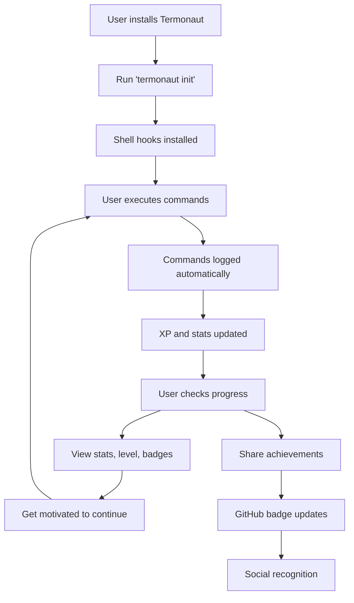

# 📋 Termonaut Project Overview

## 🎯 Project Summary

Termonaut is a **gamified terminal productivity tracker** that transforms command-line usage into an engaging RPG-like experience. It provides developers with insights into their terminal habits while making daily CLI tasks more rewarding through XP, levels, badges, and achievements.

## 🏗️ Project Structure

```
termonaut/
├── README.md                   # Project overview and user guide
├── DEVELOPMENT.md              # Technical architecture and dev setup
├── PROJECT_PLANNING.md         # Roadmap, milestones, and planning
├── AI_ASSISTANT_GUIDE.md       # Guide for AI development sessions
├── CONTRIBUTING.md             # Community contribution guidelines
├── CHANGELOG.md                # Version history and changes
├── Makefile                    # Development task automation
├── LICENSE                     # MIT license
├── .gitignore                  # Git ignore patterns
├── docs/                       # Documentation directory
│   ├── PROJECT_OVERVIEW.md     # This file
│   ├── ARCHITECTURE.md         # Technical architecture details
│   ├── API_REFERENCE.md        # CLI command reference
│   └── TROUBLESHOOTING.md      # Common issues and solutions
├── cmd/                        # CLI entry points (Go)
├── internal/                   # Private application code (Go)
├── pkg/                        # Public library code (Go)
├── termonaut/                  # Main package (Python)
├── tests/                      # Test files
├── scripts/                    # Build and deployment scripts
├── .github/                    # GitHub workflows and templates
└── assets/                     # Static assets (logos, etc.)
```

## 🔑 Key Concepts

### Core Functionality
- **Command Logging**: Capture every terminal command with metadata
- **Session Tracking**: Group commands by terminal session
- **Statistics Engine**: Compute usage metrics and trends
- **Privacy First**: All data stored locally by default

### Gamification System
- **Experience Points (XP)**: Earned for command execution
- **Levels**: Progressive advancement based on XP accumulation
- **Achievements**: Badges for milestones and special accomplishments
- **Streaks**: Consistency tracking for daily/weekly usage

### Technical Architecture
- **CLI Interface**: Command-line tool with subcommand structure
- **SQLite Database**: Local storage for commands and stats
- **Shell Integration**: Hooks for Bash, Zsh, and Fish shells
- **Modular Design**: Separate engines for stats, gamification, export

## 📊 Development Phases

### Phase 1: Foundation (v0.1-0.2)
- Core command logging infrastructure
- Basic SQLite database schema
- Simple CLI interface
- Shell hook integration

### Phase 2: Gamification (v0.3-0.5)
- XP and leveling system
- Achievement framework
- Rich terminal UI
- Advanced statistics

### Phase 3: Integration (v0.6-0.9)
- GitHub integration and badges
- Performance optimization
- Comprehensive testing
- Documentation completion

### Phase 4: Release (v1.0+)
- Stable public API
- Package manager distribution
- Community building
- Future enhancements

## 🎮 User Experience Flow



## 🛠️ Technology Stack

### Primary Options
**Go (Recommended)**
- Single binary distribution
- Excellent performance
- Strong CLI ecosystem
- Cross-platform support

**Python (Alternative)**
- Rapid development
- Rich libraries
- Easier community contributions
- Flexible deployment

### Supporting Technologies
- **SQLite**: Local data storage
- **TOML**: Configuration format
- **GitHub Actions**: CI/CD and automation
- **Shields.io**: Dynamic badge generation

## 📈 Success Metrics

### Technical Metrics
- Command logging latency < 1ms
- Database query performance < 10ms
- Memory usage < 50MB
- Test coverage > 80%

### User Metrics
- Daily active usage rate > 70%
- Average session duration
- Feature adoption rates
- User retention over 30 days

### Community Metrics
- GitHub stars and forks
- Community contributions
- Issue resolution time
- Documentation quality

## 🔄 Development Workflow

### Standard Process
1. **Plan**: Define requirements in GitHub issues
2. **Branch**: Create feature branch from main
3. **Develop**: Implement with tests and documentation
4. **Review**: Code review and automated checks
5. **Merge**: Squash commits to main branch
6. **Deploy**: Automated release process

### Quality Gates
- All tests passing
- Code coverage maintained
- Documentation updated
- Performance benchmarks met
- Security scan clean

## 🎯 Target Audience

### Primary Users
- **Software Developers**: Daily terminal users
- **DevOps Engineers**: Heavy CLI usage
- **System Administrators**: Command-line workflows
- **Power Users**: Terminal enthusiasts

### Use Cases
- **Productivity Tracking**: Understand terminal habits
- **Skill Development**: Gamified learning incentive
- **Team Analytics**: Compare productivity metrics
- **Profile Enhancement**: Showcase terminal expertise

## 🔮 Future Vision

### Short-term (6 months)
- Stable v1.0 release
- Package manager availability
- Active community of contributors
- Comprehensive documentation

### Medium-term (1 year)
- Multi-platform support (Windows)
- Team collaboration features
- Advanced analytics and insights
- Plugin ecosystem

### Long-term (2+ years)
- AI-powered productivity recommendations
- Integration with development tools
- Mobile companion app
- Enterprise features

## 📚 Documentation Index

### For Users
- [README.md](../README.md) - Installation and basic usage
- [CLI Reference](API_REFERENCE.md) - Complete command documentation
- [Configuration Guide](CONFIGURATION.md) - Settings and customization
- [Troubleshooting](TROUBLESHOOTING.md) - Common issues and solutions

### For Developers
- [Development Guide](../DEVELOPMENT.md) - Architecture and setup
- [Contributing Guide](../CONTRIBUTING.md) - How to contribute
- [AI Assistant Guide](../AI_ASSISTANT_GUIDE.md) - Consistent development
- [Architecture Details](ARCHITECTURE.md) - Technical deep-dive

### For Project Management
- [Project Planning](../PROJECT_PLANNING.md) - Roadmap and milestones
- [Changelog](../CHANGELOG.md) - Version history
- [Release Process](RELEASE_PROCESS.md) - Deployment procedures

---

This overview provides a high-level understanding of the Termonaut project. For detailed information, refer to the specific documentation files linked above.